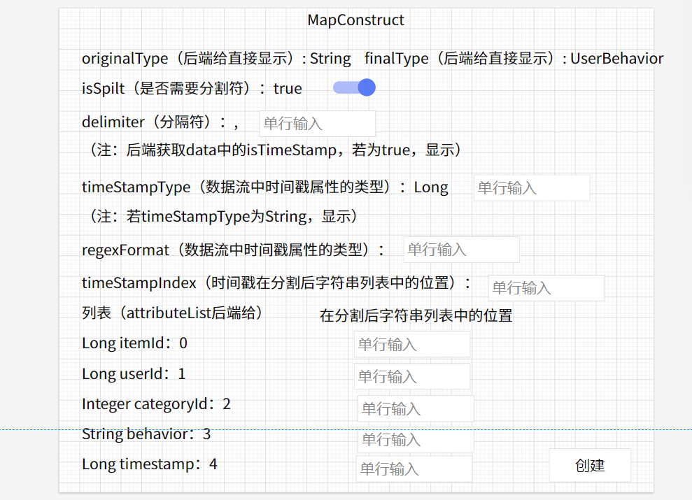
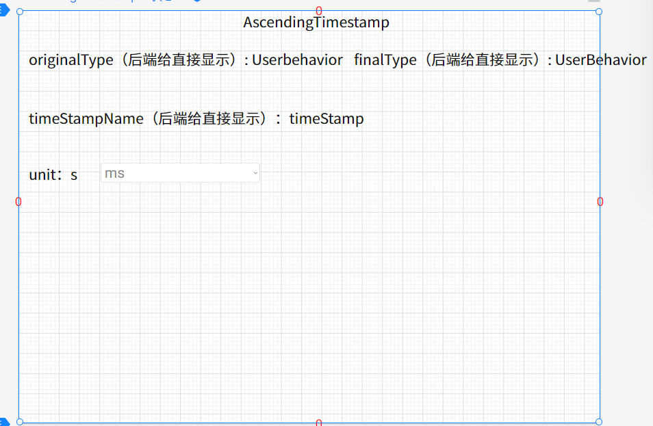
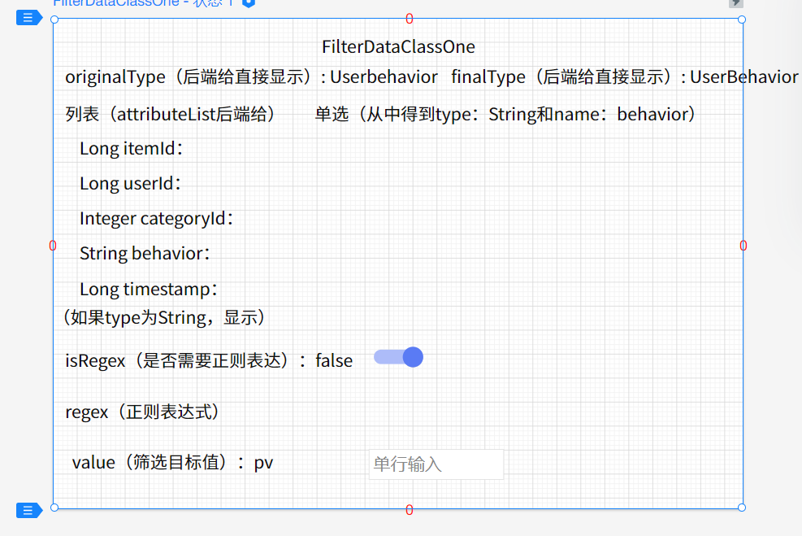
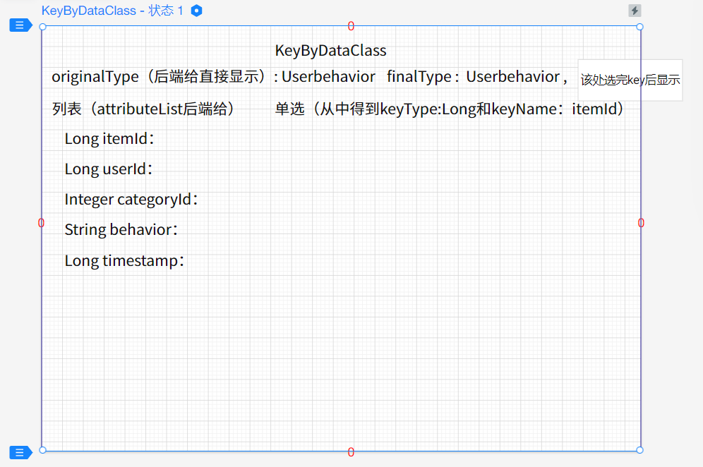
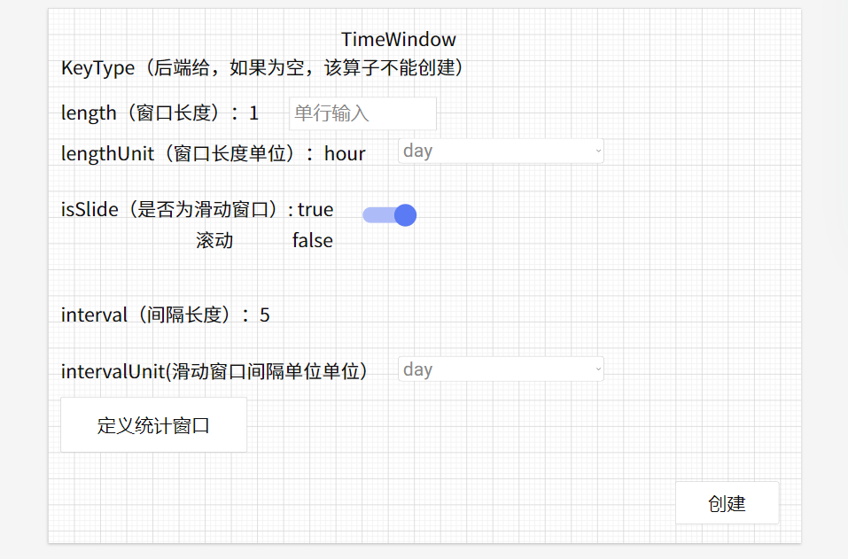
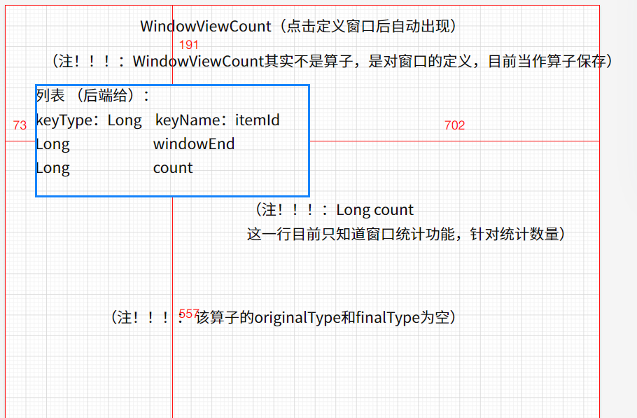
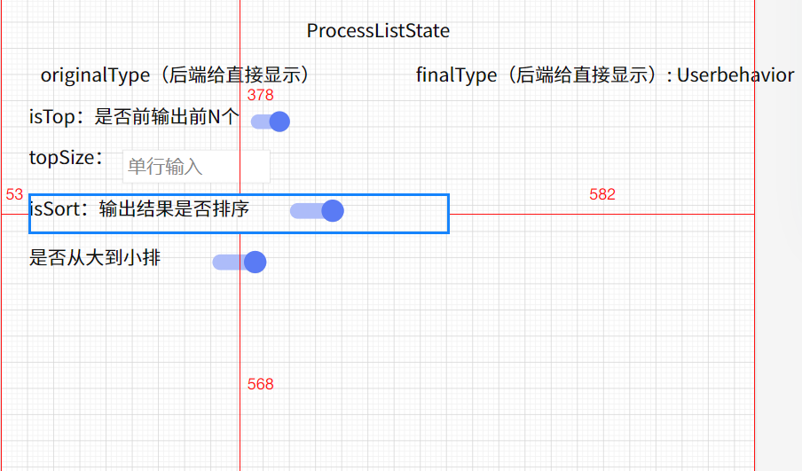

### 包说明

freemaker：从模板动态生成.java文件

generateClass：存放动态生成的.java文件

model：存放DO

​               /data：数据相关

​              /stream:算子相关，继承父类OperatorDO

### 数据注册：

data/DataDO：前端需要提供的数据，注意：提供指定时间戳功能，用户指定的时间戳属性类型为Long，并记录

​                           下间戳属性名称

FMDataModel（dataModel.ftl）：控制生成数据类

​      输入：String：className；String：userId；List<String>：type；List<String> name

DataController : /register

### 算子

#### MapConstruct

功能：将数据流转换成对应注册数据

MapConstructDO

FMMapConstruct（mapConstructModel.ftl）

界面展示：

```
finalType：dataSourceId对应的数据的className
originalType：固定为String
输入isSplit：是否需要分割数据流
 是：输入分割符delimiter
输入数据流中时间戳属性类型timeStampType
 判断是否为String
  是：输入数据流中时间戳属性格式regexFormat和在分割后字符串列表中的位置timeStampIndex（从0开始）
构造：展示时左侧为属性类型和属性名，右侧输入对应在数据流中的位置（从0开始）
```



timeWindow算子keyBYDataClass可传空

timeWindow算子finalType可传空


