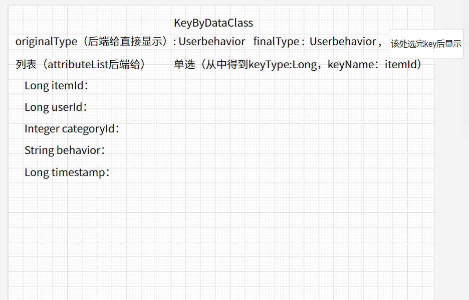

### 包说明

freemaker：从模板动态生成.java文件

generateClass：存放动态生成的.java文件

model：存放DO

​               /data：数据相关

​              /stream:算子相关，继承父类OperatorDO

### 数据注册：

data/DataDO：前端需要提供的数据，注意：提供指定时间戳功能，用户指定的时间戳属性类型为Long，并记录

​                           下间戳属性名称

FMDataModel（dataModel.ftl）：控制生成数据类

​      输入：String：className；String：userId；List<String>：type；List<String> name

DataController : /register

### 算子

MapConstruct

功能：将数据流转换成对应注册数据

MapConstructDO

FMMapConstruct（mapConstructModel.ftl）

界面展示：

```
finalType：dataSourceId对应的数据的className
originalType：固定为String
输入isSplit：是否需要分割数据流
 是：输入分割符delimiter
输入数据流中时间戳属性类型timeStampType
 判断是否为String
  是：输入数据流中时间戳属性格式regexFormat和在分割后字符串列表中的位置timeStampIndex（从0开始）
构造：展示时左侧为属性类型和属性名，右侧输入对应在数据流中的位置（从0开始）
```


timeWindow算子keyBYDataClass可传空

timeWindow算子finalType可传空


### 新增

#### 新增算子界面

（1）mapAndKeyByRandom

```
{
    "originalType":"UserBehavior",
    "finalType":"Tuple2<Integer, Long>",
    "randomSize":10
}
```

（2）processValueState

```
{
    "originalType":"WindowViewCount",
    "finalType":"WindowViewCount",
    "keyType":"Integer"
}
```

#### 编排概览

第一个编排（柱状图）：mapConstruct、assignTimeStamp、filter、keyByDataClass、timeWindow、WindowViewCount、aggregate、keyByDataClass、processListState

第二个编排（折线图）：mapConstruct、assignTimeStamp、filter、**mapAndKeyByRandom**、timeWindow、WindowViewCount、aggregate、keyByDataClass、**processValueState**

第三个编排（饼状图）：mapConstruct、assignTimeStamp、keyByDataClass、timeWindow、WindowViewCount、aggregate、keyByDataClass、processListState

#### 编排结果说明

##### 编排一

一个windowEnd代表一个柱状图，itemId横坐标、count纵坐标

```
{
windowEnd:2017-11-26 09:05:00.0,
list:[
{
itemId:5051027,
count:3
},
{
itemId:3493253,
count:3
},
{
itemId:4261030,
count:3
},
{
itemId:4894670,
count:2
},
{
itemId:3781391,
count:2
}
]
}
```

##### 编排二

一个图：折线图 横坐标：time 纵坐标：count

```
接收数据：{
time:2017-11-26 18:00:00.0,
totalCount:48292
}
```

##### 编排三

一个windowEnd代表一个饼状图，四项（pv、cart、fav、buy）

```
接收数据：{
windowEnd:2017-11-26 18:00:00.0,
list:[
{
itemId:pv,
count:48292
},
{
itemId:cart,
count:2900
},
{
itemId:fav,
count:1543
},
{
itemId:buy,
count:1167
}
]
}
```


### 操作顺序说明

注册数据源（三个编排共用一个数据源）

```
{
    "filePath":"Userbehavior",
    "userId": "638fe162a355ca0449afc0e5",
    "combinationIds":[],
    "className":"UserBehavior",
    "attributeList":[
        {
            "type":"Long",
            "name":"itemId"
        },
        {
            "type":"Long",
            "name":"userId"
        },
        {
            "type":"Integer",
            "name":"categoryId"
        },
        {
            "type":"String",
            "name":"behavior"
        },
        {
            "type":"Long",
            "name":"timeStamp"
        }
    ],
    "isTimeStamp":true,
    "timeStampName":"timeStamp"
}
```

#### 第一个编排

1. 注册编排

   ```
   {
       "name":"firstCombination",
       "dataId": "6390407736e4e2450773b8cd",
       "operatorIds":[],
       "finalTypes":[] 
   }
   ```
   
   2.mapConstruct
   
   ```
   {
       "combinationId":"6390417536e4e2450773b8ce",
       "originalType":"String",
       "finalType":"UserBehavior",
       "isSplit":true,
       "delimiter":",",
       "timeStampType":"Long",
       "regexFormat":true,
       "timeStampIndex":0,
       "dataList":[
           {
               "type":"Long",
               "index":0
           },
           {
               "type":"Long",
               "index":1
           },
           {
               "type":"Integer",
               "index":2
           },
           {
               "type":"String",
               "index":3
           },
           {
               "type":"Long",
               "index":4
           }
       ]
   }
   ```

   3.ascendingTimeStamp
   
   ```
   {
       "combinationId":"6390417536e4e2450773b8ce",
       "originalType":"UserBehavior",
       "finalType":"UserBehavior",
       "timeStampName":"timeStamp",
       "unit":"s"
        
   }
   ```
   
   4.filterDataClassOne

```
{
    "combinationId":"6390417536e4e2450773b8ce",
    "originalType":"UserBehavior",
    "finalType":"UserBehavior",
    "filterName":"behavior",
    "value":"pv",
    "isRegex":false,
    "regex":""
}
```

5.keyByDataClass

```
{
    "combinationId":"6390417536e4e2450773b8ce",
    "originalType":"UserBehavior",
    "finalType":"UserBehavior",
    "keyType":"Long",
    "keyName":"itemId"
}
```

6.timeWindow

```
{
    "combinationId":"6390417536e4e2450773b8ce",
    "originalType":"UserBehavior",
    "finalType":"UserBehavior",
    "isSlide":true,
    "lengthUnit":"hour",
    "length":"1",
    "intervalUnit":"minute",
    "interval":"5",
    "keyType":"Long",
    "keyName":"itemId" 
}
```

7.windowViewCount

```
{
    "combinationId":"6390417536e4e2450773b8ce",
    "originalType":"",
    "finalType":"UserBehavior,Long,TimeWindow",
    "keyType":"Long",
    "keyName":"itemId",
    "attributeList":[
        {
            "type":"Long",
            "name":"itemId"
        },
        {
            "type":"Long",
            "name":"windowEnd"
        },
        {
            "type":"Long",
            "name":"count"
        }

    ]
}
```

8.Aggregate

```
{
    "combinationId":"6390417536e4e2450773b8ce",
    "originalType":"UserBehavior,Long,TimeWindow",
    "finalType":"WindowViewCount",
    "keyType":"Long"
}
```

9.keyByDataClass

```
{
    "combinationId":"6390417536e4e2450773b8ce",
    "originalType":"WindowViewCount",
    "finalType":"WindowViewCount",
    "keyType":"Long",
    "keyName":"windowEnd"
}
```

10.processListState

```
{
    "combinationId":"6390417536e4e2450773b8ce",
    "originalType":"WindowViewCount",
    "finalType":"String",
    "keyType":"Long",
    "isTop":true,
    "topSize":5,
    "isSort":true,
    "isDescending":true
}
```

#### 第二个编排

1.注册编排

```
{
    "name":"secondCombination",
    "dataId": "63bd448d4fc436231cff2882",
    "operatorIds":[],
    "finalTypes":[] 
}
```

2.mapConstruct

```
{
    "combinationId":"63bd47de3fa3e0749374f4dc",
    "originalType":"String",
    "finalType":"UserBehavior",
    "isSplit":true,
    "delimiter":",",
    "timeStampType":"Long",
    "regexFormat":true,
    "timeStampIndex":0,
    "dataList":[
        {
            "type":"Long",
            "index":0
        },
        {
            "type":"Long",
            "index":1
        },
        {
            "type":"Integer",
            "index":2
        },
        {
            "type":"String",
            "index":3
        },
        {
            "type":"Long",
            "index":4
        }
    ]
}
```

3.assignTimeStamp

```
{    "combinationId":"63bd47de3fa3e0749374f4dc",
    "originalType":"UserBehavior",
    "finalType":"UserBehavior",
    "timeStampName":"timeStamp",
    "unit":"s"
     
}
```

4.filter

```
{
    "combinationId":"63bd47de3fa3e0749374f4dc",
    "originalType":"UserBehavior",
    "finalType":"UserBehavior",
    "filterName":"behavior",
    "value":"pv",
    "isRegex":false,
    "regex":""
}
```

5.mapAndKeyByRandom

```
{
    "combinationId":"63bd47de3fa3e0749374f4dc",
    "originalType":"UserBehavior",
    "finalType":"Tuple2<Integer, Long>",
    "randomSize":10
}
```

6.timeWindow

```

    "combinationId":"63bd47de3fa3e0749374f4dc",
    "originalType":"Tuple2<Integer, Long>",
    "finalType":"Tuple2<Integer, Long>",
    "isSlide":false,
    "lengthUnit":"hour",
    "length":"1",
    "intervalUnit":"minute",
    "interval":"5",
    "keyType":"Integer",
    "keyName":"itemId" 
}
```

7.WindowViewCount

```

    "combinationId":"63bd47de3fa3e0749374f4dc",
    "originalType":"",
    "finalType":"Tuple2<Integer, Long>,Integer,TimeWindow",
    "keyType":"Integer",
    "keyName":"pv",
    "attributeList":[
        {
            "type":"Integer",
            "name":"pv"
        },
        {
            "type":"Long",
            "name":"windowEnd"
        },
        {
            "type":"Long",
            "name":"count"
        }

    ]
}
```

8.Aggregate

```
{
    "combinationId":"63bd47de3fa3e0749374f4dc",
    "originalType":"Tuple2<Integer,Long>, Integer, TimeWindow",
    "finalType":"WindowViewCount",
    "keyType":"Integer"
}
```

9.keyByDataClass

```
{
    "combinationId":"63bd47de3fa3e0749374f4dc",
    "originalType":"WindowViewCount",
    "finalType":"WindowViewCount",
    "keyType":"Long",
    "keyName":"windowEnd"
}
```

10processValueState

```
{
    "combinationId":"63bd47de3fa3e0749374f4dc",
    "originalType":"WindowViewCount",
    "finalType":"WindowViewCount",
    "keyType":"Integer"
}
```

#### 第三个编排

1.注册编排

```
{
    "name":"thirdCombination",
    "dataId": "63bd448d4fc436231cff2882",
    "operatorIds":[],
    "finalTypes":[] 
}
```

2.mapConstruct

```
{
    "combinationId":"63bd4e441f352a5873918073",
    "originalType":"String",
    "finalType":"UserBehavior",
    "isSplit":true,
    "delimiter":",",
    "timeStampType":"Long",
    "regexFormat":true,
    "timeStampIndex":0,
    "dataList":[
        {
            "type":"Long",
            "index":0
        },
        {
            "type":"Long",
            "index":1
        },
        {
            "type":"Integer",
            "index":2
        },
        {
            "type":"String",
            "index":3
        },
        {
            "type":"Long",
            "index":4
        }
    ]
}
```

3.assignTimeStamp

```
{
    "combinationId":"63bd4e441f352a5873918073",
    "originalType":"UserBehavior",
    "finalType":"UserBehavior",
    "timeStampName":"timeStamp",
    "unit":"s"
     
}
```

4.keyByDataClass

```
{
    "combinationId":"63bd4e441f352a5873918073",
    "originalType":"WindowViewCount",
    "finalType":"WindowViewCount",
    "keyType":"Long",
    "keyName":"windowEnd"
}
```

5.timeWindow

```
{
    "combinationId":"63bd4e441f352a5873918073",
    "originalType":"UserBehavior",
    "finalType":"UserBehavior",
    "isSlide":false,
    "lengthUnit":"hour",
    "length":"1",
    "intervalUnit":"",
    "interval":"",
    "keyType":"String",
    "keyName":"behavior" 
}
```

6.WindowViewCount

```
{
    "combinationId":"63bd4e441f352a5873918073",
    "originalType":"",
    "finalType":"UserBehavior,String,TimeWindow",
    "keyType":"String",
    "keyName":"behavior",
    "attributeList":[
        {
            "type":"String",
            "name":"behavior"
        },
        {
            "type":"Long",
            "name":"windowEnd"
        },
        {
            "type":"Long",
            "name":"count"
        }

    ]
}
```

7.aggregate

```
{
    "combinationId":"63bd4e441f352a5873918073",
    "originalType":"UserBehavior,String,TimeWindow",
    "finalType":"WindowViewCount",
    "keyType":"String"
}
```

8.keyByDataClass

```
{
    "combinationId":"63bd4e441f352a5873918073",
    "originalType":"WindowViewCount",
    "finalType":"WindowViewCount",
    "keyType":"Long",
    "keyName":"windowEnd"
}
```

9.processListState

```
{
    "combinationId":"63bd4e441f352a5873918073",
    "originalType":"WindowViewCount",
    "finalType":"String",
    "keyType":"Long",
    "isTop":false,
    "topSize":5,
    "isSort":true,
    "isDescending":true
}
```
